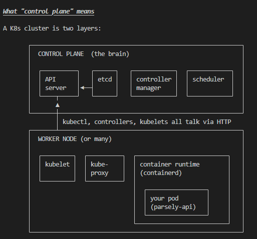
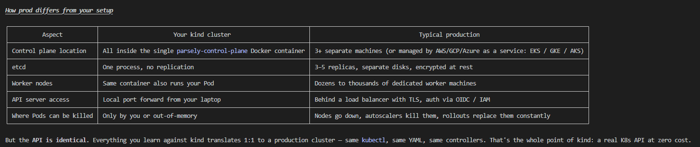

- single parsely-control-plane Docker container is your entire Kubernetes cluster, crammed into one box. kind makes a single-node cluster by default — the 
same node both runs the control plane (the brain) and runs your workloads (your Pod). In production, those would be at least two separate machines, often dozens.

- In your kind cluster, every box in that diagram is running inside the one parsely-control-plane Docker container. That's why it's a single Docker container instead of a fleet — kind is "Kubernetes-in-a-box."

## The four control plane components
1. The API server (kube-apiserver)
- The only thing in the cluster that talks to etcd. Every other component (kubectl, controllers, kubelets, even other control plane parts) goes through the API server. It's a REST API speaking HTTPS on port 6443
- When you ran kubectl apply -f deployment.yaml, kubectl turned the YAML into an HTTP POST to the API server. The API server validated it (right shape? user has permission?), then wrote it to etcd. That's all apply does at the cluster level.

2. etcd
- A small distributed key-value database. It holds the complete state of the cluster: every Namespace, Deployment, Pod, Service, Secret, ConfigMap — all of it. If etcd dies, the cluster has amnesia. If you back up etcd, you've cluster level

3. The controller manager (kube-controller-manager)
- A process that bundles dozens of "controllers." A controller is a tiny loop that does this forever
   1. Watch the API server for objects of a certain kind.
   2. Compare what exists in the cluster to what the object says it wants.
   3. Take actions to close the gap.
- The Deployment controller is one of these. When you created your Deployment, it noticed: "There's a Deployment saying replicas: 1 but no matching Pod exists. I'd better create one." It made a Pod object via the API server

4. The scheduler (kube-scheduler)
- Watches for Pods that have no nodeName set ("unscheduled"). For each one, it picks which node should run that Pod, based on resource requests, node capacity, affinity rules, etc. It then writes the chosen node back to the Pod's spec

## The worker side
Every node (worker or, in kind's case, also the control plane) runs:

kubelet
- The agent. It watches the API server for "any Pods scheduled to me?" When it sees one, it tells the local container runtime to start the right containers, sets up volumes, configures networking, then reports the Pod's status back to the API server

kube-proxy
- Implements Services. When you created your parsely-api Service, kube-proxy on every node updated the node's network rules (iptables / ipvs / eBPF, depending on config) so that traffic to the Service's IP gets load-balanced across the matching Pods. It's not a proxy process traffic flows through; it's a process that programs the kernel's networking

Container runtime
- The thing that actually runs containers. kind uses containerd (Docker's container engine without the Docker user-facing layer). crictl images from earlier was talking to containerd directly

## Concrete walkthrough — what happened when you applied your manifests

This is the story of one apply, tying it all together:

1. You ran kubectl apply -f api-py/k8s/deployment.yaml.
2. kubectl parsed the YAML and POSTed it to https://127.0.0.1:<port>/apis/apps/v1/namespaces/parsely/deployments. That endpoint is the API server inside the kind container, exposed via Docker port mapping.
3. API server validated the Deployment (does the schema match? do you have RBAC permission?), then wrote it to etcd. It returned 201 Created to kubectl.
4. Deployment controller (inside controller manager) was watching for Deployments. It saw the new object, noticed there was no matching ReplicaSet, and created one via the API server.
5. ReplicaSet controller saw a ReplicaSet with replicas: 1 and zero matching Pods. It created a Pod object via the API server (no node assigned yet — just a Pod sitting in etcd with nodeName: "").
6. Scheduler saw the unscheduled Pod, picked parsely-control-plane (the only node), patched the Pod's nodeName via the API server.
7. Kubelet on that node was watching "Pods scheduled to me?" It saw your Pod, told containerd: "pull parsely-api:dev if you don't have it, then run a container from it." containerd already had it (we kind loaded it) — no
pull needed. It started the container.
8. Kubelet started running your readinessProbe — hitting /health every 10s. When it got 200 OK, it marked the Pod Ready via the API server.
9. Endpoint controller noticed: "a Pod with label app.kubernetes.io/name=parsely-api is now Ready, and there's a Service with that selector." It added the Pod's IP to the Service's endpoint list.
10. kube-proxy saw the endpoint list change and updated iptables rules: "traffic to parsely-api.parsely.svc.cluster.local:5181 should now route to this Pod's IP."

That whole sequence took ~10 seconds and you watched it as Pending → ContainerCreating → Running → 0/1 Ready → 1/1 Ready.

